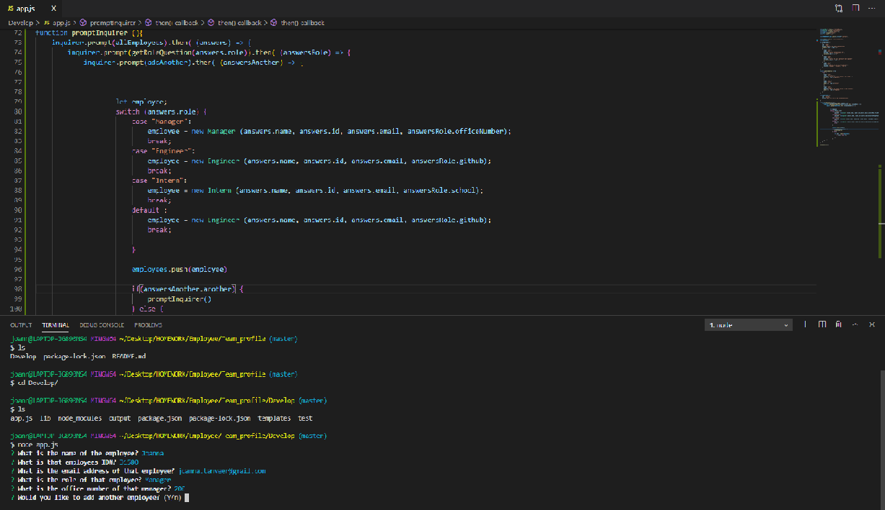
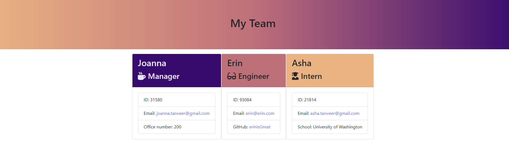

# Team Profile Generator

 

This is a CLI application that utilizes inquirer, and node.js to create a team profile webpage. The CLI asks the user information about the team and its members and routes it to the correct .html file. Jest was used to test the functionality of the application.
A simple application to gather team demographics and display them in an organized fashion.
       
## Table of Contents
        
- [Technologies](#technologies)
- [Installation](#installation)
- [Usage](#usage)
- [Credits](#credits)
- [Tests](#Tests)
- [License](#license)
- [Questions](#questions)

### Technologies
    
The technologies utilized in this application are as follows: Inquirer, jest and css-tricks.com
- Jest was used to test the classes created for each profile member
- inquirer was used for simple user input collection package. 
- css-tricks.com was used because UI. 
    
### Installation
    
To run this application successfully follow these steps:
1. Install [Team_profile](https://github.com/JoannaTanveer/Team_profile) to your local drive vis terminal/GitBash. This will install the package.json file which contains a list of all the dependencies for this application. 

2. Verify that node is installed in your computer by typing 'node' in the terminal/GitBash. If it returns
    >Welcome to Node.js v12.14.1. (or higher)
    >
    >Type ".help" for more information.
    
 Node.js is installed in your computer. If nothing happens or there is an error, visit [Node.js](https://nodejs.org/) and install the LTS version.
3. Type 'npm install' while in the terminal to install the dependencies. 

### Usage
    
The purpose of this program is to solve A simple application to gather team demographics and display them in an organized fashion., as mentioned above. Let's look a little further at how that can be accomplished.
- On the backend of the application the program in taking in user input and building the team in separate .html files.
- Classes were used and tested 
    
### Credits
    
The Dev community prides itself in the open source culture that it celebrates and maintains. This application couldn't have been made possible without the help of
-  Chris Zarlengo for his help figuring out the testing and logic. [Chris Zarlengo](https://github.com/Zarlengo)
-  Anthony Zachry for his tutoring. [Anthony Zachry](https://www.linkedin.com/in/anthony-zachry-3464b551/)
-  css-tricks.com for it's help with styling. [css-tricks.com](https://css-tricks.com/)
    
#### Thank You!

### Tests
Jest was utilized to test the classes created for each profile member. All tests passed. 
    
    
### License
Licensed under the MIT license. 

### Questions
All questions and comments are welcome! Please contact me at joanna.tanveer@gmail.com or visit my [Github Profile](https://github.com/JoannaTanveer).
